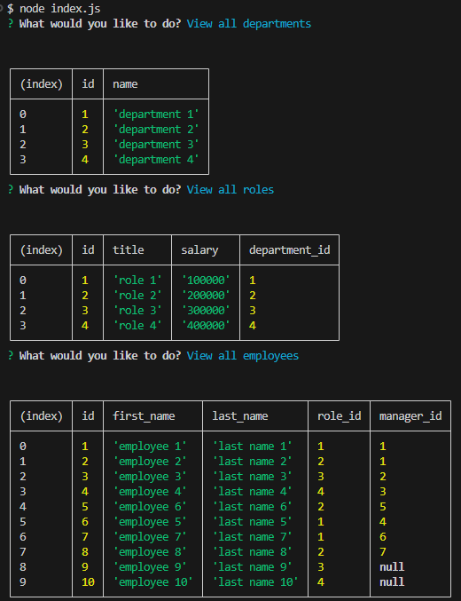

# employee-tracker

## Table of Contents

<ol>
<li>
<a href="#description"> Description </a>
</li>
<li><a href="#installation"> Installation </a>
</li>
<li>
<a href="#executing-program"> Executing program </a>
</li>
<li><a href="#usage"> Usage </a>
</li>
<li><a href="#contribution"> Contribution </a>
</li>
<li>
<a href="#tests"> Tests </a>
</li>
<li>
<a href="#screenshot-and-video"> Screenshot and Video </a>
</li>
</ol>

## Description

A command-line application to manage a company's employee database

## Installation

npm i
 
Dependencies: inquirer@8.2.4\
pg

## Executing program

After installation
 
node index.js

## Usage

Create, update departments employees and managers

## Contribution

Git clone or fork the repository and create a feature for me ❤️

## Tests

Run the index.js and give it a try!

## Screenshot and Video

The following video shows the application's appearance and functionality:\
Click on the image below for a video

